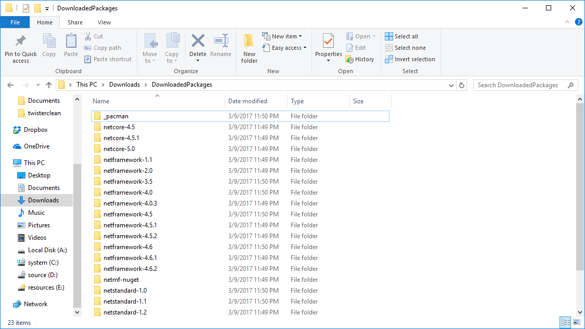

# nue

Tool to sort assemblies shipped in NuGet packages into their correct moniker folders.

## To Run

`nue.exe`

* `-m` - Operation mode. Should be either `extract` to get data from NuGet packages or `listpac` to list packages from a specific account.
* `-p` - Path to package listing CSV file.
* `-o` - Output path.
* `-a` - Account for which to list the packages.
* `-f` - Framework for which to extract the packages. Use the [TFMs](https://docs.microsoft.com/en-us/nuget/schema/target-frameworks) reference to target folders in the `lib` folder of the main package. Can be comma-separated for multiple entries.

## Content

In `extract` mode, you will get the full set of packages in the `_pacman` folder in the directory specified in the output path. Additionally, you will get package output in individual folders specified by the moniker that you listed in the package listing CSV file.

